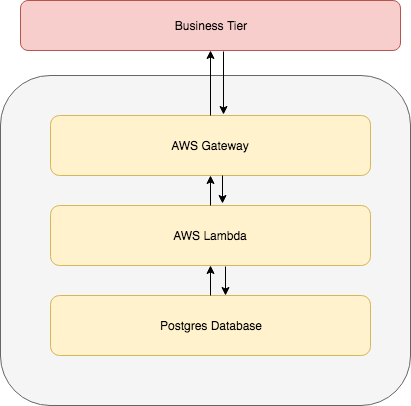

# BigBang

BigBang is a server-less backend system that is responsible to provide OFF-CHAIN data backups and APIs for Milestone
platform operations. It contains AWS API Gateway endpoints powered by lambda functions written in golang and built
using Bazel. It has three tiers: the bottom tier Postgres Database,  the middle tier AWS Lambda, and the top
tier AWS API Gateway.

1. Postgres Database
    - It backups OFF-CHAIN data in postgres database, and serves requests for data CRUD (create, read, update and delete)
      operations from the middle tier AWS Lambda.
2. AWS Lambda
    - It acts the middle communicator that converts the business logic requests from API ending points into
      database-level operations.
3. AWS API Gateway
   - It provides API ending points for business logic level operations, and send business logic requests or retrieves
     response from the middle tier  AWS Lambda.
     
     